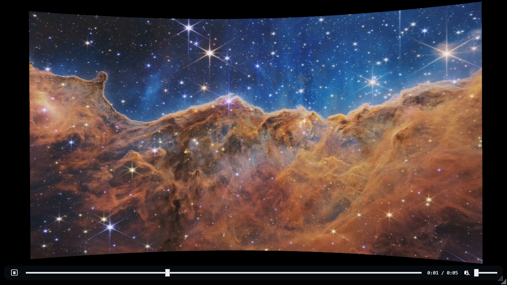
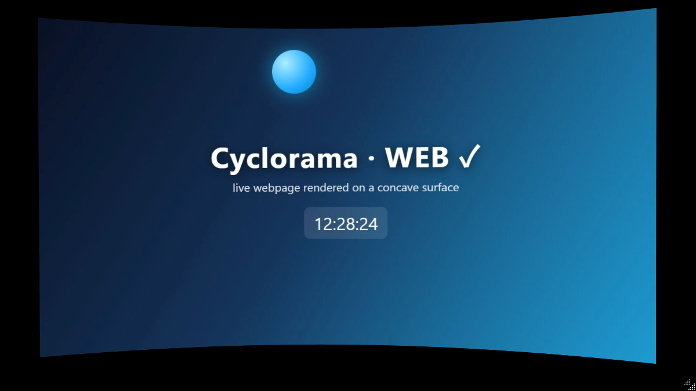

# Cyclorama Curved Screen

> A curved screen for your desktop. Point it at an image, a video, or a live web page — it appears on
> a real concave 3D surface in a borderless, transparent, draggable window, like a sci-fi viewscreen
> sitting on your desk.

   


▶ **Full demo: [`media/demo.mp4`](media/demo.mp4)** — and the demo itself is code: it's rendered
frame-deterministically from the HTML composition in [`promo/`](promo/) with
[HyperFrames](https://github.com/heygen-com/hyperframes). No video editor was involved.

A *cyclorama* is the giant curved backdrop at the rear of a theater stage that scenery is projected
onto. This is that, for your desktop.

## What it looks like

| image on the curve | video player on the curve | live web page on the curve |
|---|---|---|
|  |  |  |

The window is borderless and (almost) fully transparent — only the curved surface shows. It **leans
toward your cursor** (parallax tilt), drifts gently when idle, and can be dragged anywhere.

## Quick start

Download / build (see below), then:

- **Double-click `Cyclorama.exe`** → opens with a bundled James Webb image on the curve.
- Or give it anything:

```
Cyclorama "C:\photo.jpg"
Cyclorama "C:\clip.mp4"
Cyclorama https://example.com
Cyclorama samples\cosmic-cliffs-live.mp4     # bundled looping cosmic clip
Cyclorama samples\web-demo.html              # bundled live web page
```

The source kind is auto-detected:

| source | shown as |
|--------|----------|
| `.png .jpg .jpeg .gif .webp .bmp .tiff` | image |
| `.mp4 .webm .mov .mkv .avi .m4v .wmv`   | video — looped, GPU-smooth, with an auto-hiding play / seek / volume bar |
| `https://…`, `http://…`, or a local `.html` | live web page |

Force a kind with `--image` / `--video` / `--url`.

### Controls

- **Drag** the surface to move the window
- **Drag the bottom-right grip** to resize — the window stays locked to the content's aspect ratio, so the curve never stretches
- **Esc** closes
- Video: move the mouse to reveal the player bar (play/pause · seek · time · mute · volume)

### Options

| flag | meaning | default |
|------|---------|---------|
| `--size WxH` | initial window size (height follows the content aspect) | `480x270` |
| `--pos X,Y`  | window position | centered |
| `--curve N`  | concavity, `0`–`0.8` | `0.38` |
| `--flat`     | no curve (flat panel) | — |
| `--still`    | disable the idle drift (cursor tilt stays on) | — |
| `--top`      | always-on-top | off |
| `--mute`     | mute video audio | off |

## How it works

The content is **not** warped as a 2D effect. It's painted onto a real 3D mesh — a 64×20 grid bent
into a parabola — and viewed through a perspective camera (fov 46, `z = 4.2`). The whole
concave-vs-convex choice is one sign in the mesh's `z`:

```
concave (wraps in)   :  z = +curveDepth · nx²    // edges nearer the camera   ← Cyclorama
convex  (bulges out) :  z = -curveDepth · nx²    // centre nearer the camera
```

where `nx` runs −1 … +1 across the panel. Each source reaches the curve through the lightest
possible pipeline:

| source | pipeline | characteristics |
|--------|----------|----------------|
| image | `ImageBrush` on the mesh material | static, crisp |
| video | `MediaPlayer` → `VideoDrawing` brush | GPU-composited, smooth, looped |
| web   | offscreen **WebView2** (shared Edge runtime, not bundled) → frames copied onto the material | live pages; capture-rate capped (~30 fps) |

Other details that keep it feeling right:

- **Aspect lock at the OS level** — a `WM_SIZING` hook constrains interactive resizing to the
  content's aspect ratio, so the curved surface is never stretched.
- **Cursor parallax** — the global cursor is polled each frame; the panel eases toward it
  (max ±10°) and returns to a resting lean when you leave.
- **Flat ambient lighting** — the surface is lit uniformly white, so media shows at full brightness
  like a screen, with no 3D shading darkening the curve.
- **Failure-safe** — a broken image/video/URL degrades to a labeled placeholder panel instead of a
  black window or a crash.

## Bundled samples (`samples/`)

Real **James Webb Space Telescope** imagery to show off the curve (credits: NASA, ESA, CSA, STScI —
see [`samples/CREDITS.md`](samples/CREDITS.md), CC BY 4.0):

- `cosmic-cliffs.jpg` — the Carina Nebula "Cosmic Cliffs" (the default image)
- `pillars-of-creation.jpg` — Pillars of Creation (NIRCam)
- `deep-field.jpg` — Webb's First Deep Field (SMACS 0723)
- `cosmic-cliffs-live.mp4` — a gently-looping animated take on the Cosmic Cliffs
- `web-demo.html` — a tiny animated live page with a running clock

## The promo video is code

[`promo/index.html`](promo/index.html) is a [HyperFrames](https://github.com/heygen-com/hyperframes)
composition that rebuilds this exact curved panel in three.js (same parabola, same camera) and plays
the story — a line draws in, bends into the screen, and the screen broadcasts three Webb images with
the app's parallax tilt. Rebuild the mp4 with one command:

```
cd promo
npx hyperframes render --output ../media/demo.mp4
```

See [`promo/README.md`](promo/README.md).

## Build

```
dotnet build -c Release
# or a single-file exe:
dotnet publish -c Release -o dist --self-contained false -p:PublishSingleFile=true
```

**Requirements**

| to | you need |
|----|----------|
| build | .NET 8 SDK (Windows) |
| run   | .NET 8 Desktop Runtime |
| web source | Edge WebView2 Runtime (preinstalled on current Windows 10/11) |

## Credits & license

- Code: **MIT** — see [`LICENSE`](LICENSE).
- Bundled space imagery: **NASA, ESA, CSA, STScI** (James Webb Space Telescope), **CC BY 4.0** —
  see [`samples/CREDITS.md`](samples/CREDITS.md).
- Promo composition renders with [HyperFrames](https://github.com/heygen-com/hyperframes); vendored
  [GSAP](https://gsap.com) (standard license) and [three.js](https://threejs.org) (MIT).
